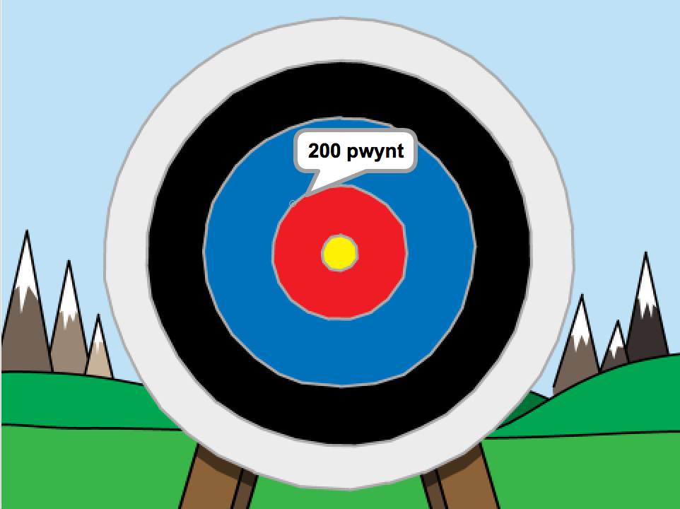

--- no-print ---

This is the **Scratch 2** version of the project. There is also a [Scratch 3 version of the project](https://projects.raspberrypi.org/cy-GB/projects/archery).

--- /no-print ---

## Cyflwyniad

Rwyt ti mynd i ddysgu sut i greu gêm saethyddiaeth, lle byddi di angen gollwng saethau at darged penodol.

  <iframe allowtransparency="true" width="485" height="402" src="https://scratch.mit.edu/projects/embed/114760038/?autostart=false" frameborder="0"></iframe>
  

--- collapse ---
---
title: Nodiadau i Wirfoddolwyr
---

## Cyflwyniad:
Yn y prosiect yma, bydd plant yn dysgu sut i greu gêm saethyddiaeth lle bydd angen iddynt ollwng saethau i geisio taro targed.

## Adnoddau

Ar gyfer y prosiect yma, dylid defnyddio Scratch 2.  Mae modd defnyddio Scratch 2 arlein yma [jumpto.cc/scratch-on](http://jumpto.cc/scratch-on) neu mae modd ei lawrlwytho yma [jumpto.cc/scratch-off](http://jumpto.cc/scratch-off) a'i ddefnyddio heb gysylltiad gwe.

Mae'r ddolen 'Adnoddau Prosiect' ar gyfer y prosiect yma yn cynnwys yr adnoddau canlynol:

## Adnoddau i Wirfoddolwyr

Mae modd gweld y prosiect wedi ei gwblhau yma <a href="http://scratch.mit.edu/projects/114760038/#editor">online</a>, neu mae modd ei lawrlwytho wrth glicio ar ddolen 'Adnoddau'r Prosiect' ar gyfer y prosiect yma, sydd yn cynnwys:

+ Archery.sb2

## Adnoddau'r Prosiect

Ar gyfer y prosiect yma, mae modd i aelodau'r clwb ddefnyddio prosiect Scratch sydd yn cynnwys yr adnoddau angenrheidiol. Mae'r prosiect ar gael yma  [jumpto.cc/archery-resources](http://jumpto.cc/archery-resources), neu mae modd ei lawrlwytho gan glicio'r 'Adnoddau Prosiect' sydd yn cynnwys:

+ ArcheryResources.sb2

Sicrhewch fod gan bob plentyn fynediad i'r adnoddau yma.

## Nodau Dysgu
+ Detholiad.

Mae'r prosiect yma yn trin elfennau sydd yn rhan o'r adran ganlynol o [Faes Llafur Gwneud Digidol Raspberry Pi](http://rpf.io/curriculum):

+ [Defnyddio cystrawen iaith raglennu sylfaenol i greu rhaglenni syml](https://www.raspberrypi.org/curriculum/programming/creator)

## Heriau
+ "Sgôr gwahanol" - Ychwanegu mwy o flociau `os`{:class="blockcontrol"} fel bod taro rhannau gwahanol o'r targed yn rhoi sgôr gwahanol. 

--- /collapse ---

