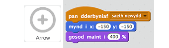
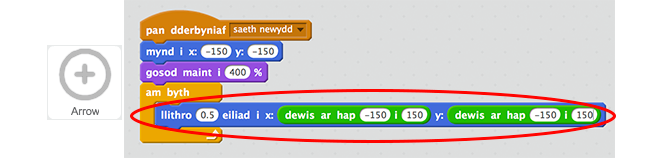

## Anelu saethau

Fe wnawn ni gychwyn trwy greu saeth sydd yn symud o gwmpas y sgrin.

+ Agora prosiect 'Saethyddiaeth' Scratch. Bydd arweinydd dy glwb yn rhoi copi o'r prosiect i ti, neu alli di ei agor arlein yma <a href="http://jumpto.cc/archery-resources" target="_blank">jumpto.cc/archery-resources</a>.

+ Pan fydd dy gêm yn cychwyn, darlleda neges i ollwng saeth newydd.

	

+ Unwaith bydd y neges yma yn cael ei dderbyn, gosod safle a maint y saeth.

	

+ Clicia'r faner werdd i brofi dy gêm. Fe ddylet ti weld dy saeth yn mynd yn fwy ac yn symud i ochr waelod-chwith y llwyfan.

	

+ Ychwanega côd i dy saeth fel ei fod yn `llithro`{:class="blockmotion"} ar hap o gwmpas y llwyfan `am byth`{:class="blockcontrol"}.

	

+ Profa dy gêm eto, ac fe ddylet ti weld dy saeth yn symud o gwmpas y llwyfan.

	
