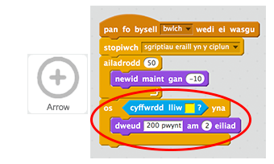

## Gollwng saethau

Fe wnawn ni ychwanegu côd i ollwng saeth wrth wasgu'r bylchwr.

+ Stopia'r sgript arall (yr un sy'n symud y saeth) wrth wasgu'r bylchwr.

	

+ Profa dy brosiect eto. Y tro hwn, fe ddylai dy saeth stopio symud __pan fo bysell bwlch wedi ei wasgu__.

+ Animeiddia dy saeth, fel ei fod yn edrych fel ei fod yn symud tuag at y targed.

	

+ Profa dy gêm eto. Y tro hwn, pan wyt ti'n gwasgu'r bylchwr fe ddylet ti weld y saeth yn lleihau, fel ei fod yn symud tuag at y targed.

	

+ Unwaith mae dy saeth yn cyrraedd y targed, alli di ddweud wrth y chwareuwr sawl pwynt mae nhw wedi eu sgorio. Er enghraifft, mae modd iddynt ennill 200 pwynt am daro'r melyn.

	

+ Fe alli di hefyd chwarae sain os ydynt yn taro'r melyn.

	

+ Yn olaf, mae angen i ti ddarlledu neges `saeth newydd`{:class="blockevents"} eto i gael saeth newydd.

	

